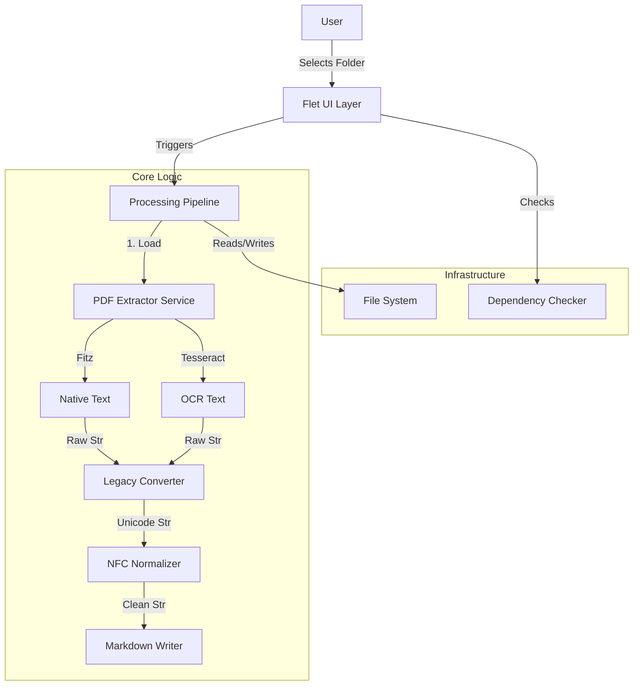

# HLD-Unitamil: Desktop PDF Converter

## 1. System Overview

Unitamil is a local desktop application that ingests PDF files, extracts text (OCR or native), converts legacy Tamil encodings to Unicode, and outputs Markdown files.

## 2. Architecture Diagram (Conceptual)

## 3. Module Design

### 3.1 UI Layer (`src/app/ui`)

- **Responsibility**: Handle user input, display progress, show visualization of logs.
- **Pattern**: Components are functional stateless/stateful widgets using Flet (MVVM-lite).
- **Design Tokens**: Defined in `design-standards.md`.

### 3.2 Core Service Layer (`src/app/core`)

- **Pipeline**: Orchestrator (Facade pattern). Manages the flow for a single file.
- **DependencyChecker**: Strategy for verifying environment.
- **Extractor**: Factory that decides between Native vs OCR strategy per page.

### 3.3 Domain Logic

- **Legacy Conversion**: Logic to map Bamini/TAB char codes to Unicode.
- **Normalization**: Standard NFC implementation.

## 4. Data Flow

1.  **Input**: User selects directory `D:\Input`.
2.  **Discovery**: App glob-matches `*.pdf`.
3.  **Loop**: For each file:
    a. Check dependencies (fail fast if invalid).
    b. Extract Page 1 -> `PageData` object.
    c. Run Heuristics (is_garbled?).
    d. Transform Text.
    e. Write `page_1.md`.
4.  **Output**: Update UI Progress Bar.

## 5. Non-Functional Requirements

- **Performance**: Must process a 100-page text PDF in < 10 seconds.
- **Reliability**: Must not crash on corrupt PDFs (graceful skip).
- **Privacy**: All processing is local.
