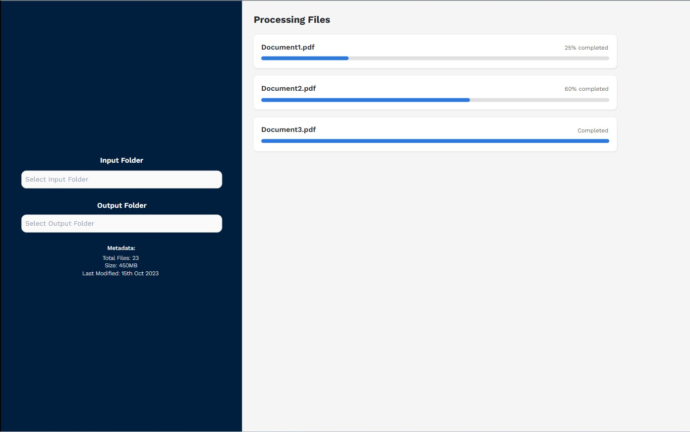

## UniTamil - Tamil Unicode Converter (Windows Utility)

---

## 1. Project Overview

This project builds a **Windows standalone utility application (EXE)** that converts **batch PDF files** into **clean Tamil Unicode Markdown output**, supporting:

- Tamil PDFs
- English PDFs
- Mixed Tamil + English PDFs
- Text-based PDFs
- Scanned PDFs (OCR)

The application runs **fully offline**, uses **Python virtual environments**, and provides a **desktop UI using Flet**.

---

## 2. Development Environment Prerequisites

### 2.1 Operating System

- Windows 10 / 11 (64-bit)

### 2.2 Python Environment (Mandatory)

- Python **3.10.x**
- One **dedicated virtual environment** per workspace

`python -m venv .venv .venv\Scripts\activate`

All libraries **must be installed inside the venv only**.

### 2.3 Required Python Libraries

`pip install \   pdfplumber \   pymupdf \   pytesseract \   pillow \   open-tamil \   langdetect \   flet \   pydantic \   tqdm \   pyinstaller`

### 2.4 OCR Engine – Tesseract (External Dependency)

**Tesseract OCR is NOT bundled initially.**
Required:

- Tesseract OCR (Windows build – UB Mannheim)
- Language packs:
  - `tam.traineddata`
  - `eng.traineddata`
  - `script\Tamil`

Expected install path:
`C:\Program Files\Tesseract-OCR\tesseract.exe`

---

## 3. UI Requirements (Flet)

### 3.1 Technology

- UI Framework: **Flet (Python)**
- No web browser dependency
- Desktop-only execution

### 3.2 Mandatory UI Screens

Design should be modern and user-friendly. follow the material design.

#### 1. Dependency Check Screen (overlay modal)

Position the Dependency Check Screen in the center of the application window.

On app launch:

- Detect `tesseract.exe`
- Detect Tamil + English language packs

If missing:

- Show **clear status indicators**
- Show **download link**
- Block processing until resolved
- Show refresh button to check again.

if all dependencies are installed then show the main processing screen.

Example UI Status:

- ❌ Tesseract OCR: Not Found
- ❌ Tamil Language Pack: Missing
- ✔ English Language Pack: Installed

#### 2. Main Processing Screen



- Main Processing Screen should be two columns layout.
- left column should have input folder picker, output folder picker, metadata, and start conversion button.
- Right column should be for processing files.
- Each pdf file should be processed in a separate thread. with progress bar. and status.
- left column width should be 30% and right column width should be 70%.
- Live logs (read-only) should be in the right column at the bottom. height of logs should be 20% of the right column.

---

## 4. Application Behavior Rules

### 4.1 Input Rules

- Input folder may contain **multiple PDFs**
- Ignore non-PDF files
- Handle corrupt PDFs gracefully

### 4.2 Output Rules

For each PDF:

```lua
output/
 └── <pdf_filename>/
     ├── extracted.md
     ├── metadata.json
     └── pages/
         ├── page_1.md
         ├── page_2.md

```

---

### 4.3 Markdown Output Format

- UTF-8 encoded
- Tamil Unicode normalized (NFC)
- English preserved exactly
- No HTML output

Example:

```md
# Page 1

இந்த ஒரு தமிழ் வரி.

This is an English line.
```

---

## 5. Processing Rules (Strict)

1. Detect **PDF type per page**
2. If text layer exists → extract text
3. If no text layer → OCR
4. OCR settings:
   - Engine: Tesseract
   - Languages: `tam+eng`
   - DPI: 96
5. Detect encoding:
   - Unicode Tamil
   - Legacy Tamil fonts (Bamini, TAB, Vanavil)
6. Convert legacy Tamil → Unicode
7. Normalize Unicode Tamil
8. Preserve English text unchanged

---

## 6. Workspace & Code Organization

```lua
workspace/
│
├── .venv/
├── app/
│   ├── ui/               # Flet UI
│   ├── pipeline/         # Orchestration
│   ├── extractor/        # PDF & OCR
│   ├── converter/        # Legacy → Unicode
│   ├── normalizer/       # Tamil normalization
│   └── utils/
│
├── build/
│   └── pyinstaller.spec
└── README.md

```
