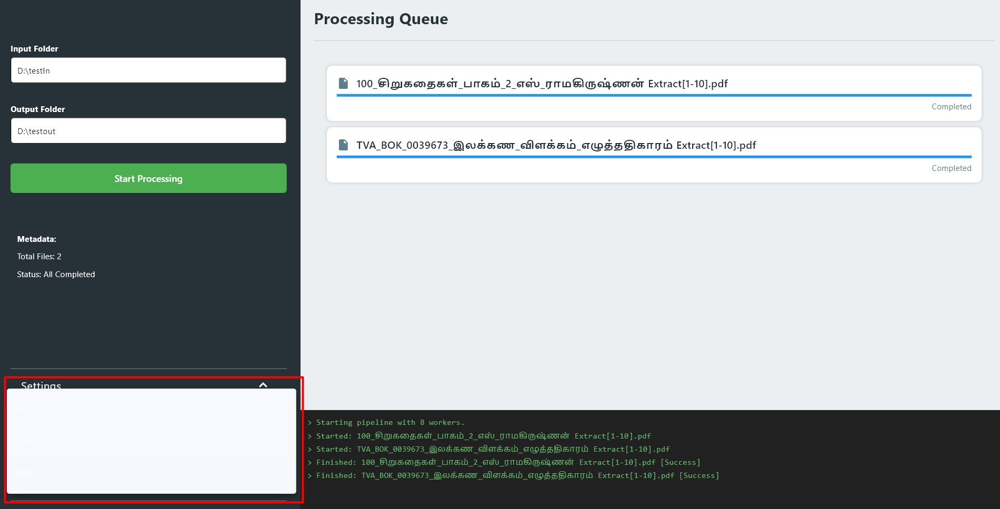

# Issues

## V1

## V2

-[ ] Dependency check screen should be in the center and middle of the application window. and should follow the material design and theme of the Main processing screen. -[ ] if Dependencies are installed then show the Main processing screen. -[ ] Start processing button should be disabled while processing. -[ ] Move Start processing button below the output folder picker. -[ ] if pdf has unreadable text then show a warning message and skip that page. and continue processing the next page. -[ ] if ocr fails due to low dpi or low quality image then show a warning message and skip that page/pdf. -[ ] Show Possible Settings for ocr and language selection in the left column bottom drawer (Expandable/Collapsible).

## V3

- [ ] DPI text should be black not white.
      

- [ ] Below Start Conversion Button, can have reset button to reset the application state. and it should show confirmation dialog before resetting.

- [ ] new reset button will become stop button when processing is started. and it should stop the processing. and it should show confirmation dialog before stopping. after stopping it should become reset button again.

- [ ] Ocr logic issue, when we convert a pdf that using tamil unicode font that convertion is not working as expected. it should convert the text to unicode tamil. but it is converting the text with different letters and boxes. do we need any font support for this?
